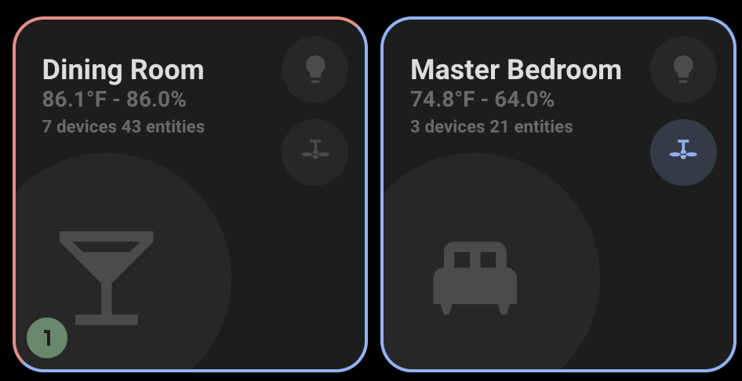
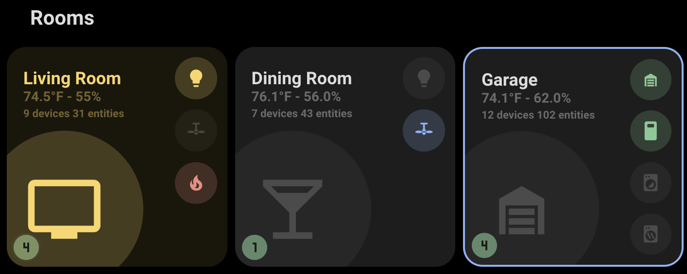

<p align="center">
    
</p>
<p align="center"><h1 align="center">Room Summary Card</h1></p>
<p align="center">
	<em>Room Data at Your Fingertips</em>
</p>


[](https://github.com/hacs/integration)


<p align="center">Built with the tools and technologies:</p>
<p align="center">
	
	
	
	
	
</p>
<br>

## Overview

A custom card for Home Assistant that provides a comprehensive room overview, including climate information, device states, and problem indicators. The card displays room temperature, humidity, connected devices, and entity states in an organized grid layout.

## Features

### Climate Information

- Displays room temperature and humidity
- Visual indicators for temperature and humidity thresholds
- Border colors indicate climate status:
  - Red: Temperature above threshold (default: 80°F)
  - Blue: Humidity above threshold (default: 60%)



### Entity Status

- Color-coded icons indicating entity states
- Interactive icons with tap/hold actions
- Climate entity colors:
  - Auto: Green
  - Cool: Blue
  - Heat: Red
  - Dry: Yellow
  - Heat/Cool: Purple
  - Fan Only: Green
  - Off: Grey



### Problem Detection

- Automatically detects entities labeled as "problem" in the area based on area and labels
- Shows count of problem entities
- Color-coded indicator:
  - Red: Active problems
  - Green: No active problems


### Room Statistics

- Shows total number of devices in the room
- Shows total number of entities in the room
- Automatic entity discovery based on area

## Installation

### HACS (Recommended)

1. Open HACS in your Home Assistant instance
2. Click the menu icon in the top right and select "Custom repositories"
3. Add this repository URL and select "Dashboard" as the category
   - `https://github.com/homeassistant-extras/room-summary-card`
4. Click "Install"

### Manual Installation

1. Download the `room-summary-card.js` file from the latest release in the Releases tab.
2. Copy it to your `www/community/room-summary-card/` folder
3. Add the following to your `configuration.yaml` (or add as a resource in dashboards menu)

```yaml
lovelace:
  resources:
    - url: /local/community/room-summary-card/room-summary-card.js
      type: module
```

## Usage

Add the card to your dashboard using the UI editor or YAML:

```yaml
type: custom:room-summary-card
area: living_room
```

The card will automatically:

- Display count + status for any entity labeled with "status" that is in the area
- Display fan/light entities based on area naming
- Update in real-time as entity states change

## Configuration Options

Most of these are optional if you setup the entities a certain way using labels and attributes. For example, see my HA configuration for my dashboard home page: [01-home.yaml](https://github.com/warmfire540/home-assistant-config-public/blob/home/ui_lovelace_minimalist/dashboard/views/01-home.yaml)

| Name                | Type             | Default                                 | Description                                                       |
| ------------------- | ---------------- | --------------------------------------- | ----------------------------------------------------------------- |
| area                | string           | **Required**                            | The area identifier for the room (e.g., 'living_room', 'kitchen') |
| entity              | string \| object | `light.<area>_light`                    | Main entity for the room                                          |
| entities            | array            | See below                               | Additional entities to display                                    |
| temperature_sensor  | string           | `sensor.<area>_climate_air_temperature` | Temperature sensor entity ID                                      |
| humidity_sensor     | string           | `sensor.<area>_climate_humidity`        | Humidity sensor entity ID                                         |
| remove_fan          | boolean          | false                                   | Remove the default light and fan entities if found                |
| skip_climate_colors | boolean          | false                                   | Disable climate-based color coding                                |
| navigate            | string           | area name (dash-separated)              | Custom navigation path when clicking the room name / icon         |

### Default Entities

By default, the card will include (if found):

- Room light (`light.<area>_light`)
  - this is also the main entity of the card by default for coloring
- Room fan (`switch.<area>_fan`) unless `remove_fan` is true

### Entity Configuration

Entities can be specified in two ways:

1. Simple string format:

```yaml
entities:
  - light.living_room_lamp
  - switch.living_room_tv
```

2. Detailed configuration object:

```yaml
entities:
  - entity_id: light.living_room_lamp
    icon: mdi:lamp
    tap_action:
      action: toggle
    hold_action:
      action: more-info
    double_tap_action:
      action: none
```

### Entity Configuration Options

| Name              | Type   | Default                 | Description                 |
| ----------------- | ------ | ----------------------- | --------------------------- |
| entity_id         | string | **Required**            | Entity ID in Home Assistant |
| icon              | string | entity default          | Custom MDI icon             |
| tap_action        | object | `{action: "toggle"}`    | Action on single tap        |
| hold_action       | object | `{action: "more-info"}` | Action on hold              |
| double_tap_action | object | `{action: "none"}`      | Action on double tap        |

### Action Configuration

Available actions for `tap_action`, `hold_action`, and `double_tap_action`:

| Action    | Parameters      | Description                  |
| --------- | --------------- | ---------------------------- |
| toggle    | none            | Toggle entity state          |
| more-info | none            | Show more info dialog        |
| navigate  | navigation_path | Navigate to a different view |
| none      | none            | Disable the action           |

Example action configuration:

```yaml
tap_action:
  action: navigate
  navigation_path: /lovelace/living-room
```

### Entity Attributes Configuration

You can add attributes to entities to customize the functionality further.

| Name                  | Type   | Default         | Description                             |
| --------------------- | ------ | --------------- | --------------------------------------- |
| on_color              | string | yellow          | Color when the entity is on or positive |
| off_color             | string | theme off color | Color when the entity is off or 0       |
| temperature_threshold | number | 80              | Threshold to show red border.           |
| humidity_threshold    | number | 60              | Threshold to show blue border.          |
| icon                  | string | entity default  | Custom MDI icon                         |

You can customize entity attributes several ways.

For entities you don't control, use [customizations](https://www.home-assistant.io/docs/configuration/customizing-devices/).

```yaml
customize:
	switch.garage_opener_plug:
		on_color: green
		off_color: red

	switch.water_softener_plug:
		on_color: green
		off_color: red

	sensor.garage_climate_air_temperature:
		temperature_threshold: 90

	sensor.shed_climate_air_temperature:
		temperature_threshold: 90
		humidity_threshold: 70
```

For entities you template, just set the attributes then.

```yaml
sensor:
  - name: Printer Left On
    unique_id: b4081d9f-24f3-4083-9fa6-70c30a432c26
    state: "{{ not is_state('sensor.mfc_7860dw_page_counter', 'unavailable') and (now() - states.sensor.mfc_7860dw_page_counter.last_updated) > timedelta(minutes=5) }}"
    icon: mdi:printer-alert
    attributes:
      icon: mdi:printer-alert
      on_color: blue
```

### Problem Entities

> [!IMPORTANT]  
> Using this setting requires a label.

Give entities a label of "Status". These entities will be tracked and the icon will show red if any are "on" or have a positive state.

## Example Configurations

### Basic Configuration

```yaml
type: custom:room-summary-card
area: living_room
```

### Full Configuration

```yaml
type: custom:room-summary-card
area: living_room
entity:
  entity_id: light.living_room_main
  icon: mdi:ceiling-light
  tap_action:
    action: toggle
  hold_action:
    action: more-info
entities:
  - entity_id: switch.living_room_tv
    icon: mdi:television
  - light.living_room_lamp
  - switch.living_room_fan
temperature_sensor: sensor.living_room_temperature
humidity_sensor: sensor.living_room_humidity
skip_climate_colors: false
navigate: /lovelace/living-room
```

### Custom Entities Only

```yaml
type: custom:room-summary-card
area: office
remove_fan: true
entities:
  - entity_id: light.office_desk
    icon: mdi:desk-lamp
  - entity_id: switch.office_computer
    icon: mdi:desktop-tower
  - entity_id: climate.office_ac
    icon: mdi:air-conditioner
```

For examples, see my HA configuration for my dashboard home page: [01-home.yaml](https://github.com/warmfire540/home-assistant-config-public/blob/home/ui_lovelace_minimalist/dashboard/views/01-home.yaml)

## Project Roadmap

- [x] **`Initial design`**: <strike>create initial room card based on button-card template in UI minimialist theme.</strike>
- [ ] **`Test on other themes`**: make sure it works elsewhere.

## Contributing

- **💬 [Join the Discussions](https://github.com/homeassistant-extras/room-summary-card/discussions)**: Share your insights, provide feedback, or ask questions.
- **🐛 [Report Issues](https://github.com/homeassistant-extras/room-summary-card/issues)**: Submit bugs found or log feature requests for the `room-summary-card` project.
- **💡 [Submit Pull Requests](https://github.com/homeassistant-extras/room-summary-card/blob/main/CONTRIBUTING.md)**: Review open PRs, and submit your own PRs.

<details closed>
<summary>Contributing Guidelines</summary>

1. **Fork the Repository**: Start by forking the project repository to your github account.
2. **Clone Locally**: Clone the forked repository to your local machine using a git client.
   ```sh
   git clone https://github.com/homeassistant-extras/room-summary-card
   ```
3. **Create a New Branch**: Always work on a new branch, giving it a descriptive name.
   ```sh
   git checkout -b new-feature-x
   ```
4. **Make Your Changes**: Develop and test your changes locally.
5. **Commit Your Changes**: Commit with a clear message describing your updates.
   ```sh
   git commit -m 'Implemented new feature x.'
   ```
6. **Push to github**: Push the changes to your forked repository.
   ```sh
   git push origin new-feature-x
   ```
7. **Submit a Pull Request**: Create a PR against the original project repository. Clearly describe the changes and their motivations.
8. **Review**: Once your PR is reviewed and approved, it will be merged into the main branch. Congratulations on your contribution!
</details>

<details closed>
<summary>Contributor Graph</summary>
<br>
<p align="left">
   <a href="https://github.com{/homeassistant-extras/room-summary-card/}graphs/contributors">
      
   </a>
</p>
</details>

## 🎗 License

This project is protected under the [SELECT-A-LICENSE](https://choosealicense.com/licenses) License. For more details, refer to the [LICENSE](https://choosealicense.com/licenses/) file.

## 🙌 Acknowledgments

- List any resources, contributors, inspiration, etc. here.
